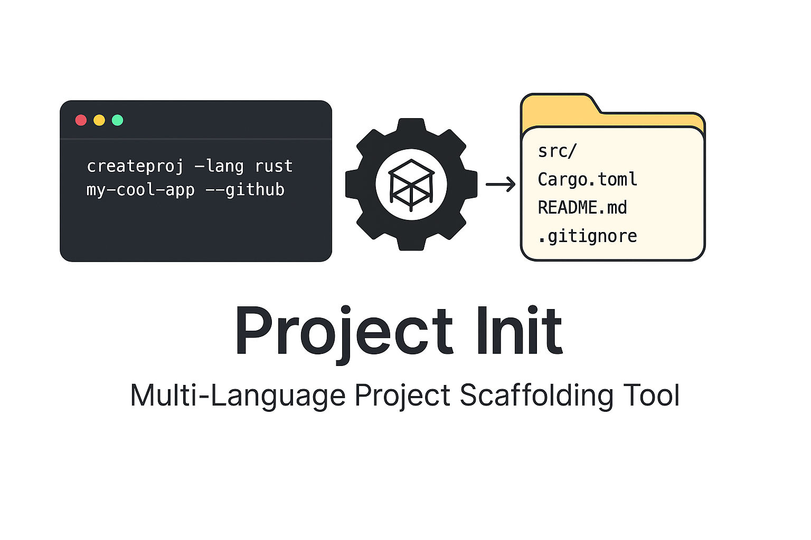

# Project Init - Multi-Language Project Scaffolding Tool

A powerful command-line tool for quickly scaffolding new projects with predefined templates for multiple programming languages. This tool creates project structures with common files, build configurations, and best practices for each supported language.



## Table of Contents

- [Features](#features)
- [Supported Languages and Templates](#supported-languages-and-templates)
- [Installation](#installation)
  - [Quick Install](#quick-install)
  - [Manual Installation](#manual-installation)
- [Usage](#usage)
  - [Basic Usage](#basic-usage)
  - [With GitHub Integration](#with-github-integration)
  - [Examples](#examples)
  - [Command Options](#command-options)
- [Template Details](#template-details)
  - [C Template](#c-template)
  - [Python Template](#python-template)
  - [Rust Template](#rust-template)
- [Requirements](#requirements)
  - [Core Requirements](#core-requirements)
  - [Optional Requirements](#optional-requirements)
- [Configuration](#configuration)
  - [Template Customization](#template-customization)
  - [Adding New Templates](#adding-new-templates)
- [Uninstallation](#uninstallation)
- [File Structure](#file-structure)
- [Version Management](#version-management)
- [Troubleshooting](#troubleshooting)
  - [Common Issues](#common-issues)
  - [Getting Help](#getting-help)
- [Contributing](#contributing)
- [License](#license)
- [Changelog](#changelog)

## Features

- 🚀 **Quick Project Setup**: Create new projects in seconds with predefined templates
- 🌐 **Multi-Language Support**: Templates for C, C++, Python, JavaScript, Frontend (HTML/CSS/JS), Rust, and Go
- 📁 **Organized Structure**: Each template includes appropriate directory structure and starter files
- 🔧 **Build System Ready**: Includes Makefiles, package.json, Cargo.toml, and other build configurations
- 📝 **Git Integration**: Automatically initializes Git repository
- 🐙 **GitHub Integration**: Optional automatic GitHub repository creation and push
- ⚙️ **Easy Installation**: Simple setup script for system-wide availability
- 🔄 **Version Management**: Intelligent version checking to avoid overwriting newer installations

## Supported Languages and Templates

| Language       | Template Includes                                       |
| -------------- | ------------------------------------------------------- |
| **C**          | Makefile, includes/, srcs/, main.c, .gitignore          |
| **C++**        | Makefile, include/, src/, main.cpp, .gitignore          |
| **Python**     | package structure, requirements.txt, tests/, .gitignore |
| **JavaScript** | package.json, index.js, lib/, .gitignore                |
| **Frontend**   | index.html, style.css, script.js, assets/, .gitignore   |
| **Rust**       | Cargo.toml, src/main.rs, .gitignore                     |
| **Go**         | go.mod, main.go, .gitignore                             |

## Installation

### Quick Install

```bash
./setup.sh install
```

### Manual Installation

1. Clone or download this repository
2. Run the setup script:
   ```bash
   chmod +x setup.sh createproj generate_template.sh
   ./setup.sh install
   ```
3. Restart your terminal or source your shell configuration:
   ```bash
   source ~/.bashrc  # or ~/.zshrc
   ```

The installer will:

- Copy scripts to `~/bin/`
- Add `~/bin` to your PATH
- Create backups of your shell configuration
- Generate templates in `~/.createproj_templates/`

## Usage

### Basic Usage

```bash
createproj --lang <language> <project-name>
```

### With GitHub Integration

```bash
createproj --lang <language> <project-name> --github
```

### Examples

Create a C project:

```bash
createproj --lang c my-c-tool
```

Create a Python project with GitHub repo:

```bash
createproj --lang python my-python-script --github
```

Create a Rust project:

```bash
createproj --lang rust my-rust-app
```

Create a frontend project:

```bash
createproj --lang frontend my-website
```

### Command Options

| Option              | Description                                                           |
| ------------------- | --------------------------------------------------------------------- |
| `--lang <language>` | Specify the project language (c, cpp, python, js, frontend, rust, go) |
| `--github`          | Create and push to a GitHub repository (requires GitHub CLI)          |
| `-h, --help`        | Show help menu                                                        |

## Template Details

### C Template

```
project_name/
├── includes/
│   ├── includes.h
│   └── typedefs.h
├── srcs/
│   └── main.c
├── extLibs/
├── obj/
├── Makefile
├── README.md
└── .gitignore
```

### Python Template

```
project_name/
├── project_name/
│   ├── __init__.py
│   └── main.py
├── tests/
│   └── test_main.py
├── requirements.txt
├── README.md
└── .gitignore
```

### Rust Template

```
project_name/
├── src/
│   └── main.rs
├── Cargo.toml
├── README.md
└── .gitignore
```

## Requirements

### Core Requirements

- Bash shell
- Git

### Optional Requirements

- **GitHub CLI (`gh`)**: Required for `--github` flag
  ```bash
  # Install GitHub CLI
  # Ubuntu/Debian:
  sudo apt install gh
  # macOS:
  brew install gh
  # Then authenticate:
  gh auth login
  ```

## Configuration

### Template Customization

Templates are stored in `~/.createproj_templates/`. You can customize any template by editing the files in the respective language directory.

### Adding New Templates

1. Create a new directory in `~/.createproj_templates/`
2. Add your template files
3. Update `generate_template.sh` to include your new template

## Uninstallation

To remove the tool completely:

```bash
./setup.sh uninstall
```

This will:

- Remove scripts from `~/bin/`
- Clean PATH modifications from shell configuration
- Create backups before making changes

## File Structure

```
project-init/
├── setup.sh              # Installation/uninstallation script
├── createproj            # Main project creation script
├── generate_template.sh   # Template generation script
└── README.md             # This file
```

## Version Management

The tool includes intelligent version management:

- Each script contains a version number
- Installation checks for newer versions before overwriting
- Prevents accidental downgrades

## Troubleshooting

### Common Issues

**Command not found after installation:**

```bash
# Reload your shell configuration
source ~/.bashrc  # or ~/.zshrc

# Or restart your terminal
```

**GitHub integration fails:**

```bash
# Install and authenticate GitHub CLI
gh auth login
```

**Template not found:**

```bash
# Regenerate templates
./generate_template.sh
```

### Getting Help

Run `createproj --help` for usage information and examples.

## Contributing

1. Fork the repository
2. Create your feature branch
3. Add or modify templates in `generate_template.sh`
4. Update version numbers in scripts
5. Test your changes
6. Submit a pull request

## License

This project is open source. Feel free to use, modify, and distribute.

## Changelog

### Version 1.0

- Initial release
- Support for C, C++, Python, JavaScript, Frontend, Rust, and Go
- GitHub integration
- Intelligent installation system
- Version management

// ...existing code...

## Contributing

Contributions are welcome! Here's how you can help improve this project:

### Ways to Contribute

- 🐛 **Report Bugs**: Open an issue describing the bug with steps to reproduce
- 💡 **Suggest Features**: Propose new languages, templates, or functionality
- 📝 **Improve Documentation**: Help make the README clearer or add examples
- 🔧 **Add Templates**: Create templates for new languages or frameworks
- 🚀 **Code Improvements**: Optimize existing code or add new features

### How to Contribute

1. **Fork the repository** on GitHub
2. **Create a feature branch** from main:
   ```bash
   git checkout -b feature/your-feature-name
   ```
3. **Make your changes**:
   - Add or modify templates in `generate_template.sh`
   - Update version numbers in scripts if needed
   - Test your changes thoroughly
4. **Update documentation** if needed
5. **Commit your changes** with clear, descriptive messages
6. **Push to your fork** and create a pull request
7. **Describe your changes** in the pull request description

### Development Guidelines

- Follow existing code style and patterns
- Test new templates thoroughly
- Update the README if adding new features
- Ensure all scripts remain POSIX-compliant where possible
- Add appropriate error handling

### Ideas for Future Contributions

- **New Language Templates**: Java, PHP, TypeScript, Swift, Kotlin
- **Framework Templates**: React, Vue, Django, Flask, Express
- **Advanced Features**: Custom template repositories, interactive setup
- **Platform Support**: Windows PowerShell compatibility
- **Documentation**: Video tutorials, advanced usage examples

We appreciate all contributions, big and small! 🙏

## License

This project is open source. Feel free to use, modify, and distribute.

## Changelog

### Version 1.0

- Initial release
- Support for C, C++, Python, JavaScript, Frontend, Rust, and Go
- GitHub integration
- Intelligent installation system
- Version management
